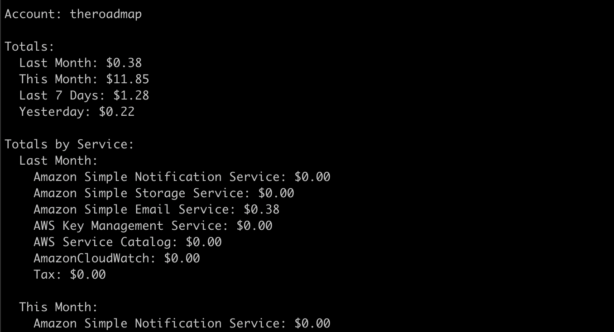
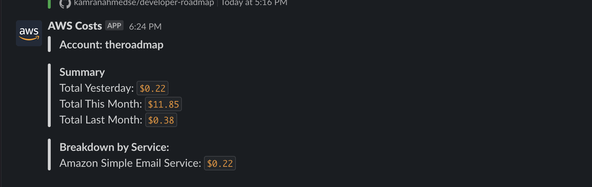

## aws-cost-cli
> CLI tool to perform cost analysis on your AWS account with Slack integration


## Installation

Install the package globally or alternatively you can also use `npx`

```bash
npm install -g aws-cost-cli
```

## Usage

For the simple usage, just run the command without any options. 

```
aws-cost
```

The output will be a the totals with breakdown by service. Optionally, you can pass the following options to modify the output:

```bash
$ aws-cost --help

  Usage: aws-cost [options]

  A CLI tool to perform cost analysis on your AWS account

  Options:
    -V, --version                  output the version number

    -k, --access-key [key]         AWS access key
    -s, --secret-key [key]         AWS secret key
    -r, --region [region]          AWS region (default: us-east-1)

    -p, --profile [profile]        AWS profile to use (default: "default")

    -j, --json                     Get the output as JSON
    -u, --summary                  Get only the summary without service breakdown
    -t, --text                     Get the output as plain text (no colors / tables)

    -S, --slack-token [token]      Slack token for the slack message
    -C, --slack-channel [channel]  Slack channel to post the message to

    -v, --version                  Get the version of the CLI
    -h, --help                     Get the help of the CLI
```

In order to use the CLI you can either pass the AWS credentials through the options i.e.:

```bash
aws-cost -k [key] -s [secret] -r [region]
```

or if you have configured the credentials using [aws-cli](https://github.com/aws/aws-cli), you can simply run the following command:

```bash
aws-cost
```

To configure the credentials using aws-cli, have a look at the [aws-cli docs](https://github.com/aws/aws-cli#configuration) for more information.

## Detailed Breakdown
> The default usage is to get the cost breakdown by service

```bash
aws-cost
```
You will get the following output


## Total Costs
> You can also get the summary of the cost without the service breakdown

```bash
aws-cost --summary
```
You will get the following output


## Plain Text
> You can also get the output as plain text

```bash
aws-cost --text
```
You will get the following output in response



## JSON Output
> You can also get the output as JSON

```bash
aws-cost --json
```

<details>
  <summary>You will get the following output in response</summary>

```json
{
  "account": "theroadmap",
  "totals": {
    "lastMonth": 0.38,
    "thisMonth": 11.86,
    "last7Days": 1.29,
    "yesterday": 0.22
  },
  "totalsByService": {
    "lastMonth": {
      "AmazonCloudWatch": 0,
      "Tax": 0,
      "AWS Key Management Service": 0,
      "AWS Service Catalog": 0,
      "Amazon Simple Email Service": 0.38,
      "Amazon Simple Notification Service": 0,
      "Amazon Simple Storage Service": 0.00001
    },
    "thisMonth": {
      "AmazonCloudWatch": 0,
      "Tax": 0,
      "AWS Key Management Service": 0,
      "AWS Service Catalog": 0,
      "Amazon Simple Email Service": 11.85,
      "Amazon Simple Notification Service": 0,
      "Amazon Simple Storage Service": 0
    },
    "last7Days": {
      "AmazonCloudWatch": 0,
      "Tax": 0,
      "AWS Key Management Service": 0,
      "AWS Service Catalog": 0,
      "Amazon Simple Email Service": 1.28,
      "Amazon Simple Notification Service": 0,
      "Amazon Simple Storage Service": 0
    },
    "yesterday": {
      "AmazonCloudWatch": 0,
      "Tax": 0,
      "AWS Key Management Service": 0,
      "AWS Service Catalog": 0,
      "Amazon Simple Email Service": 0.22,
      "Amazon Simple Notification Service": 0,
      "Amazon Simple Storage Service": 0
    }
  }
}
```
</details>

## Slack Integration

> You can also get the output as a slack message

```bash
aws-cost --slack-token [token] --slack-channel [channel]
```

You will get the message on slack with the breakdown:



You can set up a GitHub [workflow similar to this](https://github.com/kamranahmedse/developer-roadmap/blob/c1a53cf3cc5c9b77634673754c8a5af4e83466d6/.github/workflows/aws-costs.yml#L1) which can send the daily cost breakdown to Slack.

## Note

Regarding the credentials, you need to have the following permissions in order to use the CLI:

```json
{
  "Version": "2012-10-17",
  "Statement": [
    {
      "Sid": "VisualEditor0",
      "Effect": "Allow",
      "Action": [
        "iam:ListAccountAliases",
        "ce:GetCostAndUsage"
      ],
      "Resource": "*"
    }
  ]
}
```

Also, please note that this tool uses AWS Cost Explorer under the hood which [costs $0.01 per request](https://aws.amazon.com/aws-cost-management/aws-cost-explorer/pricing/).

## License
MIT &copy; [Kamran Ahmed](https://twitter.com/kamranahmedse)
